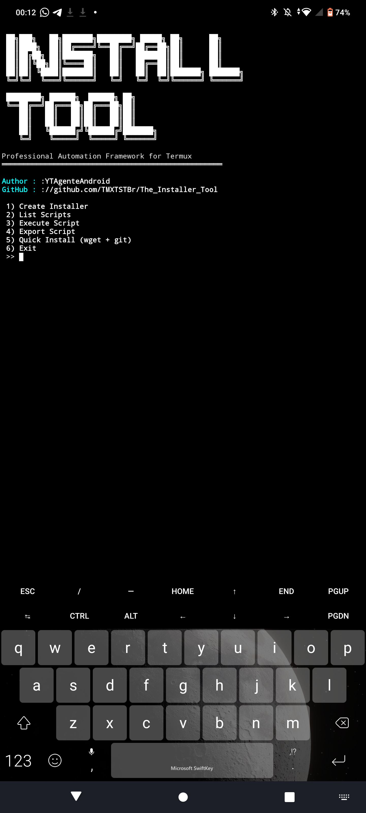

# The Installer Toll

<p align="center">


</p>


The Installer Tool is a professional automation framework designed for Termux.

It allows users to easily create, manage, and execute custom installer scripts in a simple and organized way.

## Features

- Create custom installer scripts
- Execute saved scripts easily
- Clean interactive menu interface
- Animated startup screen
- Global command installation
- Lightweight and fast

## Why use The Installer Tool?

Instead of manually typing multiple installation commands every time,
you can create your own installer scripts and run them instantly.

Perfect for:

- Termux users
- Automation lovers
- Developers
- Script creators
- Beginners learning Bash

## Installation

```bash
pkg install git -y
git clone https://github.com/TMXTSTBr/The_Installer_Tool.git
cd The_Installer_Tool
chmod +x I_T.sh
```

After installation, run:
```bash
I_T.sh
```
## Export

Location where scripts are saved after exporting:

```
/storage/emulated/0/InstallerTool/
```

## ScreenShot


